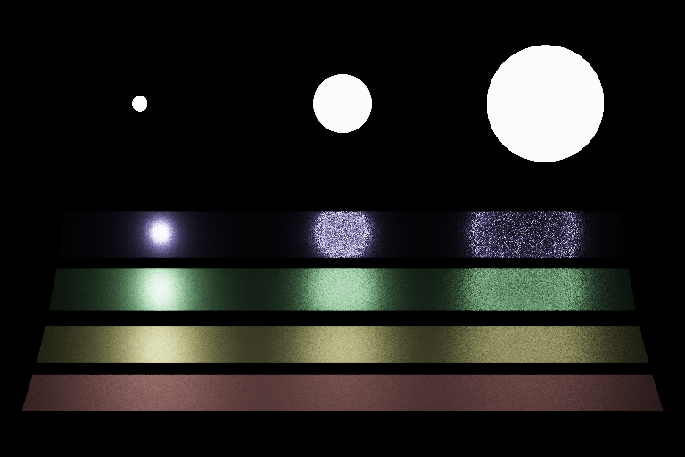
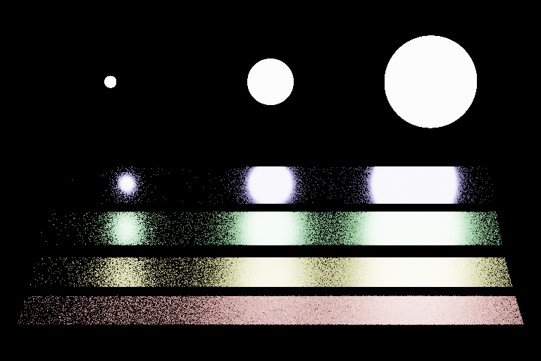
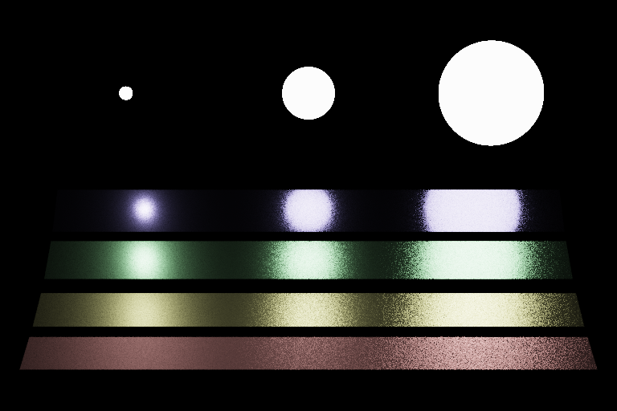
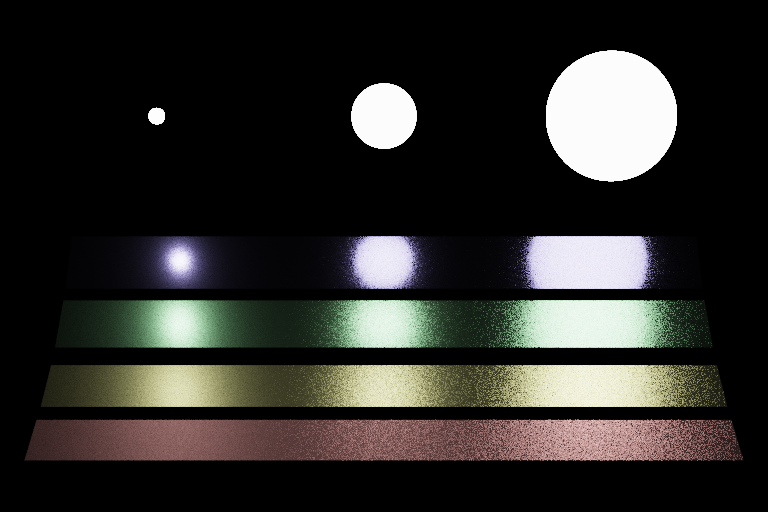
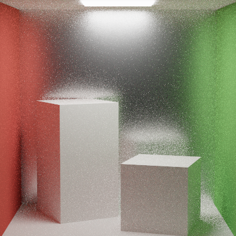
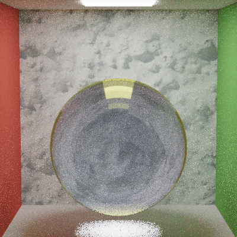
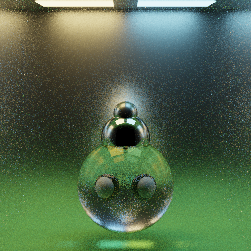
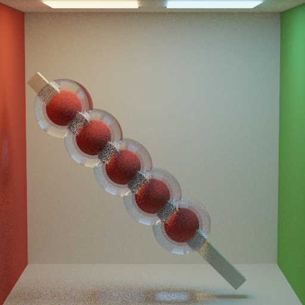
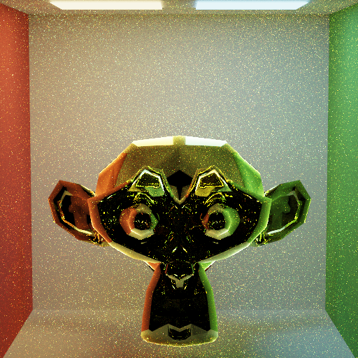
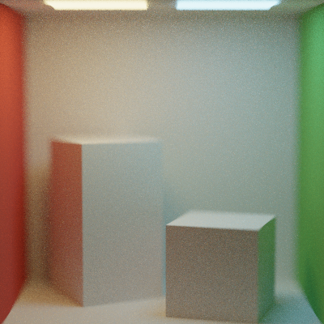

Monte Carlo Path Tracer
======================

University of Pennsylvania, CIS 561: Advanced Computer Graphics, Course Project
------------
# Features:
- Ray Intersection
- Direct Lighting/global illumination
- Normal Map
- Multiple Importance Smampling
- Lens-based Camera
- Acceleration: Kd-Tree
- Normal Mapping
# Images:
## Multiple Importance Sampling
direct light sampling

BSDF sampling

Multiple Importance Sampling: Power heuristic and Balanced heuristic

## Global Illumination
Rough Box

Glass Ball

Mirror Balls

Candied Haws

Glassy Suzanne

Thin Lens Camera

